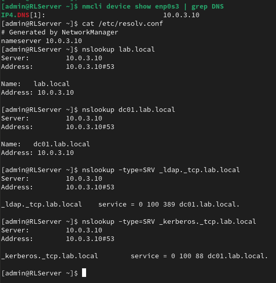
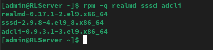
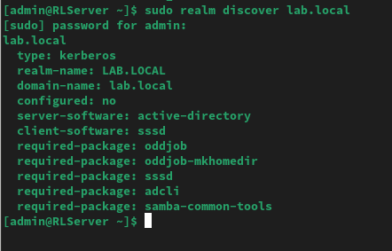
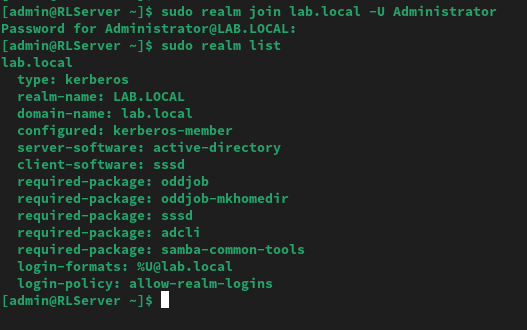
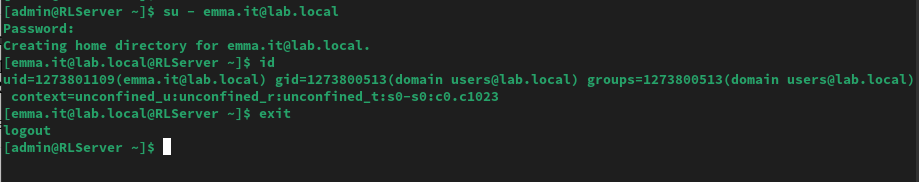
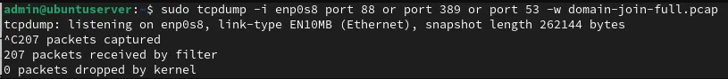
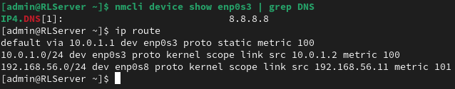

# Active Directory Domain Join

Domain-joining the Linux and Windows clients built earlier in this lab to the `lab.local` Active Directory domain running on DC01. Covers Rocky Linux via realmd/SSSD, LDAP queries from a joined client, and a live packet capture of the Kerberos/LDAP/DNS traffic during the join. Fedora and Windows 11 join, GPO verification, and final AD-side confirmation are still in progress.

**Status: In Progress.** This README documents what has been completed so far and what is still left to do.

---

## Table of Contents

- [What I Built So Far](#what-i-built-so-far)
- [Tech Stack and Environment](#tech-stack-and-environment)
- [Project Files](#project-files)
- [The Build](#the-build)
  * [1. DNS Prerequisite Check on Rocky Linux](#1-dns-prerequisite-check-on-rocky-linux)
  * [2. Installing realmd, SSSD, and adcli](#2-installing-realmd-sssd-and-adcli)
  * [3. Domain Discovery and Join](#3-domain-discovery-and-join)
  * [4. AD Login Verification](#4-ad-login-verification)
  * [5. Packet Capture During Domain Join](#5-packet-capture-during-domain-join)
- [Troubleshooting and Real Issues](#troubleshooting-and-real-issues)
  * [Issue 1: DNS Configured on the Wrong Interface](#issue-1-dns-configured-on-the-wrong-interface)
  * [Issue 2: AD Login Failed With Bare Username](#issue-2-ad-login-failed-with-bare-username)
- [What's Left](#whats-left)
- [What I Learned So Far](#what-i-learned-so-far)

---

## What I Built So Far

Rocky Linux (`10.0.1.2`) is now fully joined to `lab.local` using realmd and SSSD. Before attempting the join, I confirmed DNS was pointing correctly at DC01 (`10.0.3.10`), including SRV record resolution for `_ldap._tcp` and `_kerberos._tcp`, since `realm join` depends on both to locate the domain controller and authenticate the join itself.

After joining, I tested an actual AD login with a domain user and confirmed the UID, GID, and group membership all resolved from AD rather than local `/etc/passwd`. I also left the domain and rejoined it while running a live `tcpdump` capture on the Ubuntu gateway, so the Kerberos (port 88), LDAP (port 389), and DNS (port 53) traffic from a real join is captured in full and available in `configs/domain-join-full.pcap`.

Fedora, Windows 11, GPO verification, and the final AD-side confirmation of all joined clients are not done yet. Those are listed under [What's Left](#whats-left).

---

## Tech Stack and Environment

| Component | Specification |
|---|---|
| Host OS | Rocky Linux 9.7 (Blue Onyx) |
| Hypervisor | Oracle VirtualBox |
| Gateway OS | Ubuntu Server |
| Domain Controller | Windows Server 2022 Datacenter Evaluation |
| AD Domain | lab.local |
| Clients Being Joined | Rocky Linux 9 (10.0.1.2) ; Fedora (10.0.1.3) ; Windows 11 (10.0.1.4) |
| Join Method (Linux) | realmd + SSSD + adcli |
| Packet Capture | tcpdump (Ubuntu gateway, enp0s8) |

---

## Project Files

| File | Source Path | What It Shows |
|---|---|---|
| [domain-join-full.pcap](configs/domain-join-full.pcap) | captured on Ubuntu enp0s8 | Full packet capture of Rocky's domain join, showing DNS SRV lookups, Kerberos AS-REQ/AS-REP exchanges, and LDAP search traffic between Rocky and DC01. Open in Wireshark for protocol-level detail. |

---

## The Build

### 1. DNS Prerequisite Check on Rocky Linux

Before attempting any domain join, I confirmed DNS on Rocky's labnet interface (`enp0s3`) was pointing at DC01. My first pass caught DNS still resolving to `8.8.8.8`, an inherited public resolver that would never resolve `lab.local` or its SRV records. I also initially configured DNS on the wrong interface entirely before catching the mistake with `ip route`. That's documented in [Issue 1](#issue-1-dns-configured-on-the-wrong-interface) below.

Once DNS was corrected, I verified full resolution:

```
nslookup lab.local
nslookup dc01.lab.local
nslookup -type=SRV _ldap._tcp.lab.local
nslookup -type=SRV _kerberos._tcp.lab.local
```

All four returned clean results pointing to `10.0.3.10`, with the SRV records confirming LDAP on port 389 and Kerberos on port 88 via `dc01.lab.local`.



---

### 2. Installing realmd, SSSD, and adcli

```
sudo dnf install realmd sssd adcli samba-common oddjob oddjob-mkhomedir -y
```

`realmd` handles domain discovery and join. `sssd` manages authentication caching and AD user/group lookups. `adcli` performs the actual AD computer object creation under the hood. `oddjob-mkhomedir` auto-creates a home directory for AD users on first login.

```
rpm -q realmd sssd adcli
```

confirmed all three installed with version numbers returned.



---

### 3. Domain Discovery and Join

```
sudo realm discover lab.local
```

correctly identified `lab.local` as an Active Directory realm with SSSD as the client software, confirming DNS and SRV records were set up correctly.

```
sudo realm join lab.local -U Administrator
```

`realm join` returns no output on success. I confirmed the join with:

```
sudo realm list
```

which showed `configured: kerberos-member`, along with the login format `%U@lab.local` and a login policy allowing realm logins. Good command to remember, it's a faster way to check domain status than digging through `/etc/sssd/sssd.conf` directly.




---

### 4. AD Login Verification

I tested an actual domain login with an AD user:

```
su - emma.it@lab.local
```

This required the full UPN format rather than the bare username. See [Issue 2](#issue-2-ad-login-failed-with-bare-username) for what happened on the first attempt.

Once logged in, I ran `id` to confirm identity resolution was actually coming from AD:

```
id
```

Output showed `uid=1273801109(emma.it@lab.local)` and `gid=1273800513(domain users@lab.local)`, both AD-issued values rather than local Rocky UIDs, along with a home directory auto-created by `oddjob-mkhomedir` on first login.



---

### 5. Packet Capture During Domain Join

To capture the actual Kerberos, LDAP, and DNS traffic generated by a domain join, I left the domain and rejoined it while running tcpdump on the Ubuntu gateway:

```
sudo realm leave lab.local
```

Then, from a separate session on Ubuntu:

```
sudo tcpdump -i enp0s8 port 88 or port 389 or port 53 -w domain-join-full.pcap
```

With the capture running, I rejoined Rocky to the domain:

```
sudo realm join lab.local -U Administrator
```

The capture ran clean: 207 packets captured, 207 received by filter, 0 dropped by kernel. Reading the capture back confirmed DNS SRV lookups for `_ldap._tcp` and `_kerberos._tcp`, followed by TCP sessions on ports 389 and 88 between Rocky (`10.0.1.2`) and DC01 (`10.0.3.10`). The full capture is saved at `configs/domain-join-full.pcap` for anyone who wants to inspect it in Wireshark.



---

## Troubleshooting and Real Issues

### Issue 1: DNS Configured on the Wrong Interface

**Problem:** I configured DNS through `nmtui` on `enp0s8`, expecting it to be Rocky's labnet-facing interface.

**Cause:** `enp0s8` is actually the VirtualBox host-only adapter used for SSH management (`192.168.56.11`), not labnet. Rocky's real labnet interface, with the default route to the Ubuntu gateway at `10.0.1.1`, is `enp0s3`.

**Fix:** I confirmed the correct interface with:

```
ip route
```

which showed the default route going out `enp0s3`, not `enp0s8`. I renamed both NetworkManager connections to reflect their actual roles (`ssh-mgmt-enp0s8` and `labnet-enp0s3`) so this wouldn't be ambiguous again, then set DNS on the correct interface.

Always confirm which interface actually carries the traffic you're configuring for, especially in a VM with more than one adapter. A connection name or device name alone doesn't tell you its role. `ip route` does.



---

### Issue 2: AD Login Failed With Bare Username

**Problem:** `su - emma.it` failed with "user does not exist or the user entry does not contain all the required fields."

**Cause:** `realm list` had already shown the answer in its `login-formats: %U@lab.local` field. SSSD was configured to expect the full UPN format, not the bare sAMAccountName-style username.

**Fix:** I re-ran the login using the full UPN:

```
su - emma.it@lab.local
```

which succeeded and auto-created the home directory on first login.

The `realm list` output tells you the exact login format a domain expects before you ever try to log in. Worth checking that field first instead of guessing at username format.

---

## What's Left

Still need to run ldapsearch from Rocky against AD, then join Fedora and Windows 11 the same way Rocky was joined. Once all three clients are in, gpresult /r on Windows 11 should confirm the four GPOs from Project 3 applied, and Get-ADComputer -Filter * on DC01 should show all three as domain members. Last step is a basic hostname ping test between the joined clients to confirm AD DNS is resolving them correctly.

---

## What I Learned So Far

DNS isn't just groundwork here, it's the actual dependency the whole join is built on. `realm join` won't throw you a clear error if DNS is subtly wrong. It just quietly fails to find the domain controller, or worse, finds the wrong thing. Checking SRV records first saved me from what would've been a confusing failure with no obvious cause later.

Interface names and connection names in a multi-adapter VM don't tell you anything about role. `ip route` does. I renamed both connections after this so the profile name itself carries that information going forward, rather than relying on memory.

`realm list` isn't just a status check, it's documentation. The `login-formats` field told me exactly what username format to use before I had to guess or search for it.

I forgot to have tcpdump running for the actual join, so I just left the domain and rejoined it with the capture already going. That didn't affect anything I'd already tested, like the AD login.
